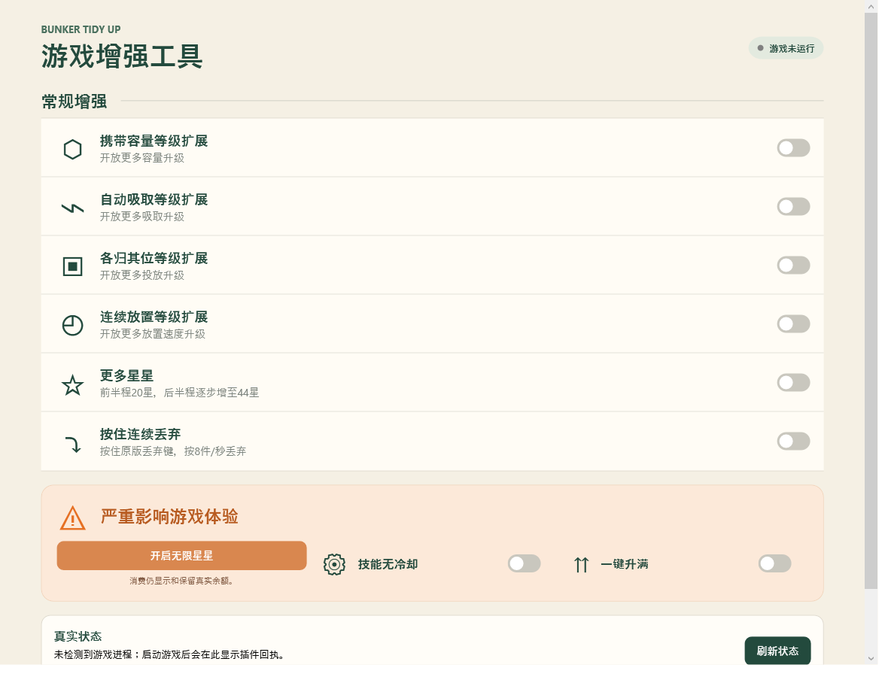

# Bunker Tidy Up 游戏增强工具

**当前版本：1.0.3 · Windows x64 · 简体中文**

本工具为 Bunker Tidy Up 提供自动加载的 Unity Mono 插件和桌面控制器。首次安装时所有功能均关闭；安装完成后可以关闭控制器，插件会随游戏自动运行。

| 直接下载 | 文件 |
| --- | --- |
| [Windows 安装程序](https://github.com/loaye1203/BunkerTidyUpTrainer/releases/download/v1.0.3/BunkerTidyUpTrainer-1.0.3-Setup.exe) | 将桌面控制器安装到当前 Windows 用户目录，并可立即启动控制器 |
| [便携 ZIP](https://github.com/loaye1203/BunkerTidyUpTrainer/releases/download/v1.0.3/BunkerTidyUpTrainer-1.0.3-Portable.zip) | 解压后运行控制器，不写入 Windows 安装目录 |

安装程序和便携包都包含控制器、游戏插件、BepInEx 运行文件、许可文本和验证报告。控制器采用 .NET 10 自包含发布，玩家无需另装 .NET。安装程序只安装桌面工具；它不会在安装时自动改动游戏目录。请在控制器中选中游戏根目录，确认游戏已经退出，再点击“安装 / 检查”来部署插件。



## 安装与首次启用

1. 下载并运行 Windows 安装程序；或将便携 ZIP 解压到可写目录。
2. 启动 `BunkerTidyUpTrainer.exe`，在“游戏路径”处选择包含 `Bunker.exe` 的游戏根目录。
3. 确认 Bunker Tidy Up 已完全退出，点击“安装 / 检查”。本工具会自动识别兼容加载器或本工具残留、备份存档和配置、补齐缺失文件并重建安装记录；只有无法确认兼容的组件或已修改的文件才会阻止安装。
4. 启动游戏。状态面板显示新鲜插件回执后，修改器已经自动生效；之后无需让控制器常驻。
5. 首次安装时八个开关均关闭，无限星星按钮也处于关闭状态。按需开启功能。

便携 ZIP 与安装程序使用同一 Payload。首次安装结束后，控制器只保存所选游戏路径；配置保存在游戏的 `BepInEx/config/BunkerTidyUpTrainer/`。插件自动加载，不依赖桌面程序是否打开。

## 遇到已有 winhttp.dll 时

1.0.3 不再仅凭 `winhttp.dll` 的文件名拒绝安装。玩家无需删除 DLL、找文件属性或重装游戏，退出游戏后点击“安装 / 检查”即可。

控制器按文件内容识别当前发行包对应的原样 Unity Doorstop 4.5.0/BepInEx 5.4.23.5，以及已公开的 1.0.0–1.0.2 本工具插件。只剩启动 DLL、手动复制过 Payload、安装记录丢失或损坏时，可以补齐文件并自动重建记录；已有 `settings.json` 和扩展等级侧档保留，替换前的文件与配置会备份。

已有同版本加载器时，其他插件保持原样。兼容的 Doorstop 配置也保留；若其预加载入口正确但 `enabled=false`，会备份后只启用入口，不重置其他设置。复用的加载器按共享文件处理，移除本工具后恢复其安装前状态，不删除其他模组；识别到的本工具旧插件会移除，不会在卸载时重新恢复旧插件。

其他版本或修改过的代理、MelonLoader、其他预加载入口及特殊启动配置不在自动接管范围，控制器仍保留原文件并明确提示。文件级兼容识别不代表任意其他模组的游戏行为都已验证。

## 主界面功能

常规增强区有六个开关：

| 开关 | 行为 |
| --- | --- |
| 携带容量等级扩展 | 解锁携带容量 8–16 级；10 级起按住原拾取动作可持续范围拾取，具体规则见下文。 |
| 自动吸取等级扩展 | 解锁自动吸取 7–15 级，保留原技能目标选择、逐件处理逻辑及新等级冷却。 |
| 各归其位等级扩展 | 解锁各归其位 4–10 级，原有货架匹配和整理行为不变。 |
| 连续放置等级扩展 | 解锁连续放置 6–10 级；只提高新增等级的放置速率参数，原版 1–5 级不变。 |
| 更多星星 | 对每种新完成整理的物资，按存档里已完成种类数发放渐进奖励；不会重复奖励已完成种类。 |
| 按住连续丢弃 | 首次仍调用原版丢弃；按住原丢弃动作后每秒最多再丢 8 件，松开即停止。 |

下方“严重影响游戏体验”区域有一个按钮和两个开关：

| 控件 | 行为 |
| --- | --- |
| 无限星星按钮 | 开启后购买免消费，关闭后恢复正常扣费；真实余额仍然保留并显示，不会被改成巨大数值。 |
| 技能无冷却 | 只去掉技能释放后的冷却等待。持续时间、执行中互斥和物资逐件处理节奏仍保留，不会让技能重入。 |
| 一键升满 | 临时按每项当前允许的上限生效。扩展开启的项目可以到扩展上限，关闭扩展的项目按原版上限；关闭后回到真实购买等级，不把临时等级写成购买记录。 |

所有开关与按钮状态会保存，并由游戏插件在主线程应用。控制器显示“已保存”不等于游戏已运行；只有状态回执新鲜且修订号已经应用，界面才显示插件连接。

## 等级、效果与费用

四项新增等级的费用只在正常购买时支付。原版等级和原版费用完整保留；扩展开关关闭时商店恢复原版等级上限，已购买的扩展记录仍保留，再次开启无需重买。临时升满期间不扣费用，也不改变真实购买等级。

| 项目 | 原版上限与费用 | 新增上限与效果 | 新等级费用 |
| --- | --- | --- | --- |
| 携带容量 | 7 级；5、10、20、30、50、60、80 星 | 8–9 级每级 +10；10–16 级每级 +15；16 级容量 200 | 100、106、112、118、125、132、142、152、167 星 |
| 自动吸取 | 6 级；20、30、40、50、60、70 星 | 7–10 级数量 35/40/45/50、冷却 22/20/18/15 秒；11–15 级数量 60/70/80/90/100、冷却 14/13/12/11/10 秒 | 71、71、72、72、73、74、75、75、76 星 |
| 各归其位 | 3 级；50、75、100 星 | 4–10 级冷却 80/70/60/50/45/40/30 秒 | 101、102、102、103、103、103、104 星 |
| 连续放置 | 5 级；10、20、30、40、50 星 | 新增 6–10 级每级 +5 次/秒，新增等级的最高参数为 50 次/秒 | 51、52、53、54、55 星 |

未扩展的原版项目费用为：ItemFinder 150、ShelfFinder 150、HandGrouping 10、MoveSpeed 35、JumpHeight 35 星。扩展四项原版部分为 900 星，原版所有项目总额为 1,280 星。扩展新增费用为 2,796 星，四项新增费用分别为携带 1,154、自动吸取 659、各归其位 718、连续放置 265 星；新增费用按等级不递减，原版价格不变。

更多星星沿用游戏已持久化的 `ScoredTypes` 完成种类计数：第 1–68 种各 20 星，第 69–92 种依次为 21–44 星，第 93–136 种各 44 星。136 种都在启用更多星星期间首次完成时，合计 4,076 星，恰好等于新档全部升级费用（原版 1,280 + 新增 2,796）。如果此前已买等级或已取得余额，工具不会追补星星、退款或回溯历史费用；没有开启更多星星时已完成的种类也不会补发。

## 携带扩展中的范围拾取

范围拾取没有单独开关；只有携带扩展开启且当前生效等级达到 10 级时才启用。10–16 级按住原版拾取动作时，会以鼠标当前瞄准点为中心，持续重新搜索半径 1.0 个世界单位内最近的一件合法地面物资，并调用游戏原本的拾取方法。原版点击行为保留；松开输入后，范围拾取立即停止。每次成功拾取后按实时节拍安排下一件，不补发追赶批次，也不设置每次按住的总件数上限。

| 携带等级 | 目标拾取速率 | 目标间隔 |
| --- | ---: | ---: |
| 10 | 5 件/秒 | 200 毫秒 |
| 11 | 6 件/秒 | 约 166.7 毫秒 |
| 12 | 7.2 件/秒 | 约 138.9 毫秒 |
| 13 | 8.64 件/秒 | 约 115.7 毫秒 |
| 14 | 10.368 件/秒 | 约 96.5 毫秒 |
| 15 | 12.4416 件/秒 | 约 80.4 毫秒 |
| 16 | 14.92992 件/秒 | 约 67.0 毫秒 |

速率按 5 × 1.2^(等级−10) 计算；实际拾取受游戏帧率影响，每次更新最多尝试一件。搜索只接受仍未拾取且通过原版交互距离、图层、遮挡、楼层和容量检查的地面物资；货架中的物品不参与，容量满时不会继续拾取。它不会改动 V 键自动吸取技能对同类物品的规则。自动吸取技能仍按原有逐件 0.05 秒节奏处理。按住丢弃使用原版丢弃动作和 TryDrop，每 125 毫秒最多调用一次；松开、暂停、失焦或游戏 UI 锁定输入时停止。

## 存档、关闭与完整恢复

原版存档的等级字段保持在原版可读范围。超出原版上限的真实购买等级按槽位写入插件侧扩展记录，记录与保存文件指纹关联；临时升满不污染真实购买等级。新档、删除档、换槽和外部替换存档不会继承另一档扩展购买记录。扩展关闭会恢复原版数值和购买上限，但保留该档扩展等级；携带容量下降时已有手持物资不会被删除，超额期间不能继续拾取，但仍能正常放置或丢弃。

从 1.0.0/1.0.1 更新后，如果当前存档文件指纹与旧侧档匹配、且侧档的 Carry 等级为 17–21，插件会先备份原侧档，再把 Carry 记录迁移为 16；ItemPull 等其他技能记录保留。此迁移不退还已花星星，也不补扣费用；下次游戏通过原版流程成功保存时，新的等级侧档随之提交。指纹不匹配时不会把旧侧档套用到另一份存档。

完整恢复会把所有效果与等级恢复为原版状态，并等待游戏对当前恢复请求成功保存。多存档时，**每个仍存在的槽位都要载入并保存一次**，之后退出游戏，控制器才会逐槽核对回执、存档指纹和库存容量。任何槽位仍有超过该档原版容量的手持物、侧档缺容量信息、存档指纹不匹配或保存回执过期时，控制器会拒绝卸载插件；先整理相应槽位、载入并成功保存，再重试。

1. 在控制器中点击“恢复原版并停用插件”，所有功能会关闭。
2. 启动游戏，逐个载入所有还要保留的存档槽；整理手持物到该档原版容量内并完成一次正常保存。
3. 退出游戏后回到控制器，确认每个槽位都通过容量与指纹检查，再点击“完成恢复并移除”。若游戏未运行，需先使用插件启动并保存确认，再执行移除。
4. 插件清单、扩展购买侧档和本工具备份按安装器的恢复规则保留；仅删除已登记且哈希匹配的本工具文件，不覆盖用户后续修改。

安装前的游戏文件副本和存档副本保存在当前用户的 `%LOCALAPPDATA%\BunkerTidyUpTrainer\` 下。扩展侧档随游戏安装目录的 `BepInEx/config/BunkerTidyUpTrainer/slots/` 保存。更换电脑时，需同时备份玩家的 `Saves` 目录及插件配置目录中的 `settings.json`、`slots`；只复制主存档不会带走超原版等级。开始菜单中的“卸载桌面工具”快捷方式（或安装目录内 `Uninstall.exe`）只移除用户目录中的控制器文件，不会恢复或卸载游戏插件；要移除游戏插件，请先在控制器中完成上述恢复流程。

## 兼容、验证范围与已知限制

此版本针对 Windows x64、Bunker Tidy Up Unity 6000.0.59f2 Mono，使用 BepInEx 5.4.23.5。兼容加载器的识别、文件保留和安装修复经过文件管理测试；其他模组的游戏内行为、其他游戏版本及 IL2CPP 未验证。不要将本工具的插件文件安装到其他游戏。

验证报告：[1.0.3 验证报告](docs/验证报告-1.0.3.md)。本版测试自动修复、共享加载器保留、旧发行插件接管、正常移除及未知组件拒绝覆盖；所有测试使用工作区内文件夹夹具，没有启动玩家游戏或编辑真实玩家存档。[1.0.2 验证报告](docs/验证报告-1.0.2.md) 保留携带迁移与虚拟输入的游戏内验证结果，1.0.0/1.0.1 历史报告也保留；本版游戏玩法和数值未改。

安装器部署时不直接编辑玩家存档；游戏仍通过原版保存流程写入主存档，超出原版等级的扩展记录单独保存在插件侧档。安装器会备份需要触碰的游戏文件；测试和安装回执不能替代自行备份重要存档。工具不会修改 `Bunker.dll` 或 Unity 游戏程序集。

## 从源码构建

开发者需要 Windows、PowerShell 7 或 Windows PowerShell 5.1、Git 和 .NET 10.0.401 SDK；可以使用本机游戏文件读取 Unity Managed 引用，也可通过网络下载 Unity 6000.0.59 编译引用，无需安装本机游戏。玩家使用安装程序或便携 ZIP，不需要安装 .NET。

```powershell
git clone https://github.com/loaye1203/BunkerTidyUpTrainer.git
cd BunkerTidyUpTrainer
.\scripts\Build-Release.ps1 -GamePath "D:\Games\Bunker Tidy Up"
# 或使用官方 Unity 6000.0.59 编译引用（无需本机游戏）
.\scripts\Build-Release.ps1 -UnityVersion 6000.0.59
```

构建脚本从 BepInEx 官方发布页取固定的 5.4.23.5 Windows x64 包，并校验 SHA-256；Unity API 引用可从 `-GamePath` 的 `Bunker_Data\Managed` 读取，或用 `-UnityVersion 6000.0.59` 下载官方编译引用。依赖缓存、构建输出和 NuGet 缓存都放在本地 `.artifacts/`，不会提交进源码仓库。也可传入 `-BepInExArchive <本地压缩包路径>` 使用已下载且哈希匹配的同版本官方压缩包。输出包括插件/控制器、便携 ZIP 和自解压 Windows 安装程序。

发行包构建完成后，可运行安装恢复测试（不启动游戏）：

```powershell
dotnet run --project tests/Trainer.Installation.Tests/Trainer.Installation.Tests.csproj --configuration Release -- .artifacts/release/v1.0.3/portable/Payload .
```

源码目录：

- `src/Trainer.Controller/`：WPF 桌面控制器与事务安装/恢复逻辑。
- `src/Trainer.Shared/`：控制器和游戏插件共享的配置、状态、存档协议。
- `src/BunkerTidyUp.Mod/`：BepInEx/Harmony 插件及运行时补丁。
- `installer/`：Windows 用户级自解压安装器源码。
- `scripts/`：参数化构建与发行打包脚本。
- `docs/`、`licenses/`：验证报告、界面预览与第三方许可。

## 许可、第三方与反馈

本工具自有代码、安装器及文档以 [MIT License](LICENSE) 发布，Copyright (c) 2026 loaye1203。发行包同时包含 `THIRD-PARTY-NOTICES.md` 和相应许可全文。BepInEx、HarmonyX/Harmony、MonoMod 和 Mono.Cecil 归各自权利人所有；Windows 启动代理 Unity Doorstop 使用 LGPL-2.1。发行包未包含游戏原始程序集、场景资源或玩家存档。

遇到安装、兼容或存档恢复问题，请在 [GitHub Issues](https://github.com/loaye1203/BunkerTidyUpTrainer/issues) 提交问题，并附上游戏版本、插件日志中与问题相关的片段和操作步骤。分享日志前请先移除用户名、个人路径、存档内容或其他隐私信息；不要直接上传完整玩家存档。
